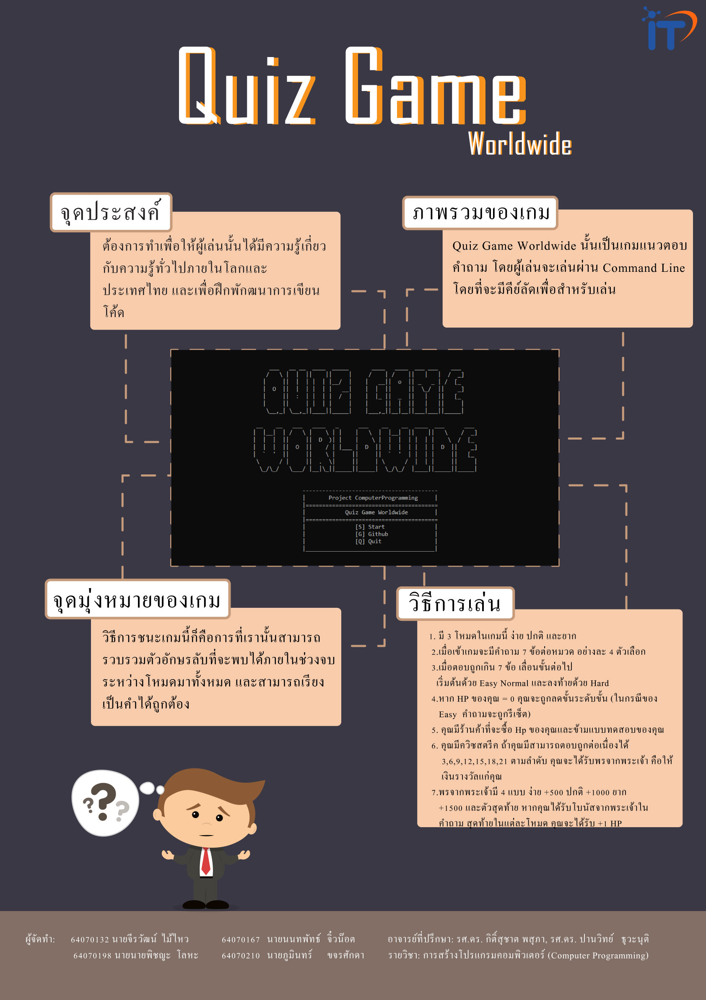

# Quiz Game Worldwide
Computer Programming Project KMITL Semester 2/2020 1st Year

## ที่มา
> 

## วัตถุประสงค์
> ต้องการทำเพื่อให้ผู้เล่นนั้นได้มีความรู้เกี่ยวกับความรู้ทั่วไปภายในโลกและประเทศไทย และเพื่อพัฒนาการเขียนโค้ด

## Website

## Video

## Poster
> * [Poster (download)](https://drive.google.com/u/1/uc?id=1t4YyNaY0fB7iYnSVVjrXCsk5jGsxqMG0&export=download)
> 
>  

---
สมาชิก
---

| รหัสนักศึกษา | ชื่อ - นามสกุล | Github |
| :-------- | :-------- | :--------- |
|  64070132  |  นายจีรวัฒน์ ไม้ไหว  | [JeerawatM](https://github.com/JeerawatM)   |
|  64070167  |  นายนนทพัทธ์ จิ๋วน๊อต  | [Squid3rd](https://github.com/Squid3rd)  |
|  64070198  |  นายนายพิชญะ โลหะ  | [PichayaLoha](https://github.com/PichayaLoha)   |
|  64070210  |  นายภูมินทร์ ขจรศักดา | [TanPoomin](https://github.com/TanPoomin)  |